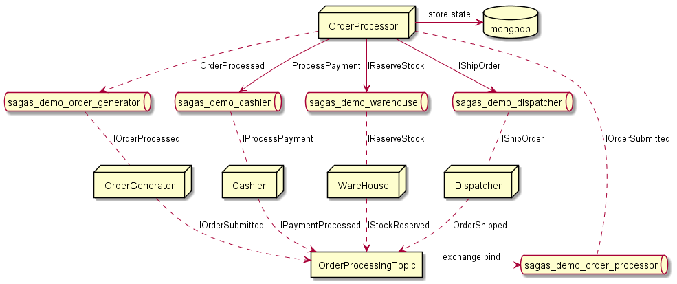

# Event overview

The order generator publishes an `IOrderSubmitted` event to the `OrderProcessing` exchange. That exchange is configured to fan out the messages to the `saga_demo_order_processor` queue.

The `saga_demo_order_processor` is being read by the `OrderProcessor`, that processes the Order (stored in the `mongodb` database) and sends commands to 3 queues according to the saga configuration in sequence according to the state of the order.

The first command `IReserveStock` is sent to the `saga_demo_warehouse`. That queue is picked up by the `WareHouse`, the order is reserved and the `WareHouse` publishes that the order has been reserved (`IStockReserved`) to the `OrderProcessing` topic.

Then the `OrderProcessor` picks up `IStockReserved` and sends an `IProcessPayment` command to the `saga_demo_cashier`. That queue is picked up by the `Cashier` app, the order is payed for and the `Cashier` publishes that the order has been payed (`IPaymentProcessed`) to the `OrderProcessing` topic.

Then the `OrderProcessor` picks up `IPaymentProcessed` and sends an `IShipOrder` command to the `saga_demo_dispatcher`. That queue is picked up by the `Dispatcher` app, the order is dispatcher and the `Dispatcher` publishes that the order has been dispatched (`IOrderShipped`) to the `OrderProcessing` topic.

Finally the `OrderProcessor` closes the order and publishes an `IOrderProcessed` to the `OrderProcessing` topic where is gets sent to the `saga_demo_order_generator`. There the `OrderGenerator` app picks it up and displays it back to the user that the Order has been processed.
